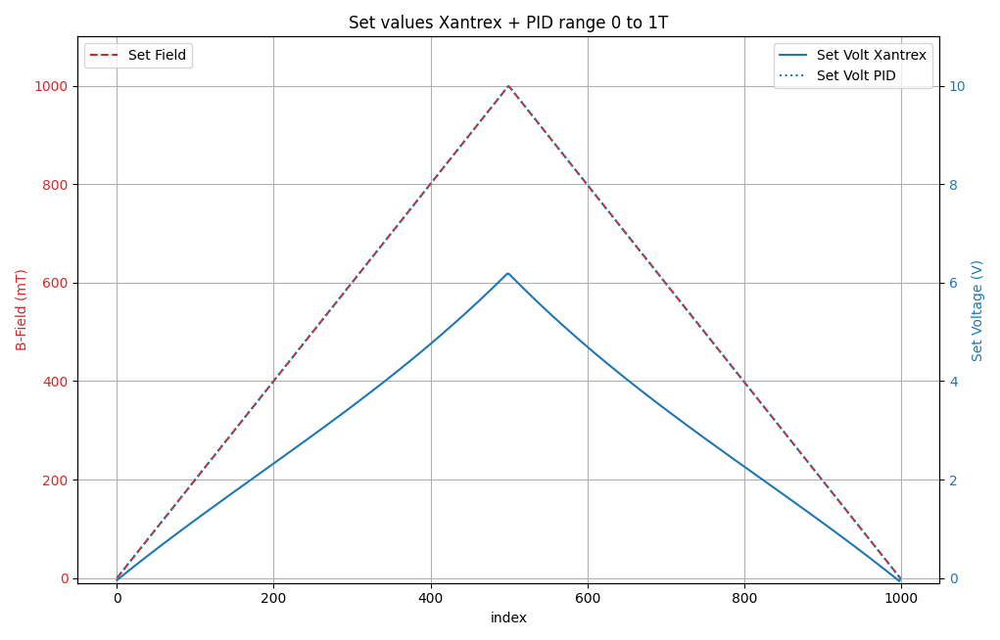
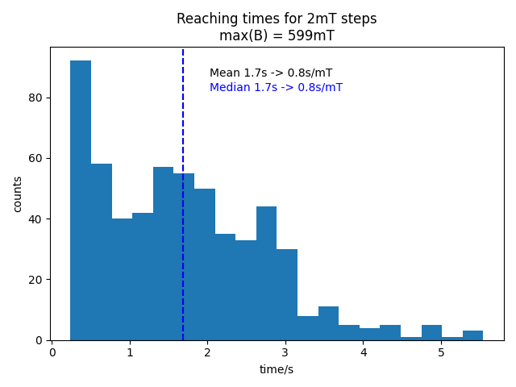

.. Bruker Hall and MR Measurements documentation master file, created by
   sphinx-quickstart on Thu Feb 10 13:57:36 2022.
   You can adapt this file completely to your liking, but it should at least
   contain the root `toctree` directive.

Welcome to Bruker Hall and MR Measurements's documentation!
===========================================================

Description
-----------

Controlled ramping of a B-field function and measuring
Lockin-Amplifier parameters. Can be used for *Hall-effect* and *MR*
measurements.

H-Field Ramp
~~~~~~~~~~~~
The waveform for the ramp is generated automatically by means of the
parameters (start, stop, increment, etc.) in :download:`measurement config file <../config/measurement.yaml>`.
Based on this wave 2 set-values are generated for
1. the xantrex power supply and
2. the PID-controller.
The first is taken from a fit-function (see the following figure) based
on B-field measurements for different power supply voltages.

	The fit-function is generated from the data provided in "B-field-lookup.yaml". The order of the fit-function can be passed by setting the ~deg~ parameter.
	If not provided, a fit of the first order is calculated.

.. image:: ../doc/field-set-functions_many-points.png
   :width: 80%

The PID-controller value is just a scaled value based on the ramp
wave. See the following figure for an example for a triangular shaped ramp from 0 to 1T

Bruker time-constant
~~~~~~~~~~~~~~~~~~~~
Needed to prevent runaways of the is value that must be compensated by the PID-controller and result in (too) high currents.
This happens when the set values are increased too fast for the Bruker magnet to follow (main coil). 
The time-constant describes the time it takes the main coil to reach a new set value. It is calculated in s/mT and can be scaled 
by the respective step size of a measurement. The scaled value should be awaited between subsequent set values.
A time-constant of *0.8s/mT* follows from a field-ramp measurement form 0 to 600mT in 2mT steps.

	The time-constant was calculated by ramping the B-field with the xantrex power supply only. It is assumed that a new set value 
	is reached when two subsequent (200ms apart from one another) B-field measurements differ by less than 0.1mT. This time was recorded and taken as a basis for 
	the calculation.

Measurement
~~~~~~~~~~~
The SR8320 sources a sinus voltage, which generates a "constant"
current by means of a high resistance (kΩ). The input is locked in at
the source frequency. For every value in of the waveform array

- the respective B-field is set,
- the process waits until the B-field is within the boundary "delta-start" configured in :download:`measurement config <../config/measurement.yaml>`
- a number of N measurements is recorded and written to a file

Usage
--------
::
   
  git clone --recurse-submodules https://gitlab.lrz.de/m-aximilian/bruker-hall.git
  cd bruker-hall

Notes and Parameters
-------------------------
Parameters
~~~~~~~~~~
- Hall Sensor: 1V := 100mT
- Xantrex voltage range: 0-150V
  
Hardware
----------
- 2T Bruker Magnet
- `xantrex XFR 150-8 <https://www.manualslib.com/manual/633965/Xantrex-Xfr-6-200.html#product-XFR%20150-8>`
- `Stanford Research SR830 Lockin Amplifier <https://www.thinksrs.com/downloads/pdfs/manuals/SR830m.pdf>`
- Audio Amplifier with PID-controller

Modules
----------

.. toctree::
   modules

Indices and tables
==================

* :ref:`genindex`
* :ref:`modindex`
* :ref:`search`
